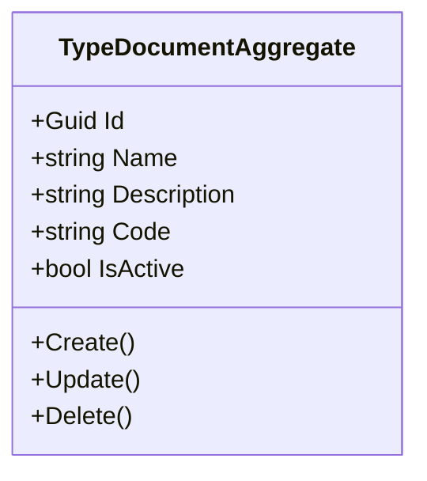
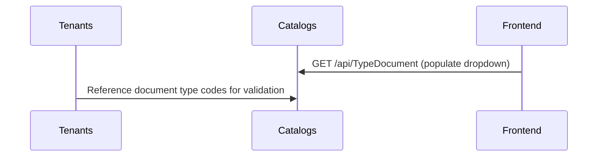

# Catalogs Microservice

## Overview

The Catalogs microservice manages extensible reference data catalogs used across the platform. Currently it maintains the `TypeDocument` catalog, which stores the types of identification documents recognized by the system (CC, NIT, RFC, Passport, etc.). This catalog is consumed by the Tenants microservice for organizational identification and by any other service that needs to classify document types for users or organizations.

## Business Context

A multi-country platform must support different identification document types depending on the jurisdiction: Colombia uses CC (Cedula de Ciudadania) and NIT (tax ID), Mexico uses RFC, the United States uses SSN and EIN, and international users may have passports. Rather than hardcoding these options in each microservice, a centralized catalog provides a single authoritative list that can be extended as the platform expands to new markets.

The Catalogs microservice provides this extensible reference data layer. Each catalog entry has a code (for programmatic matching), a name (for display), and an optional description. The catalog is designed to grow over time with additional reference data types beyond documents.

For a new developer: this is the "lookup tables" service of the platform. Whenever a dropdown or picker needs reference data that is shared across services, it likely comes from here.

## Ubiquitous Language

| Term         | Definition                                                                                                              |
| ------------ | ----------------------------------------------------------------------------------------------------------------------- |
| TypeDocument | A recognized identification document type. Each has a code (e.g., "CC"), a name (e.g., "Cedula de Ciudadania"), and description. |
| Code         | A short, stable identifier for the document type, used for programmatic matching and storage. Unique across the catalog. |
| Name         | The human-readable display name of the document type, shown in UI dropdowns and forms.                                   |
| Description  | An optional textual explanation of the document type for administrative reference.                                        |
| Catalog      | A conceptual grouping of reference data entries. Currently only TypeDocument exists; the architecture supports adding more.|
| IsActive     | Whether the catalog entry is currently available for selection in forms and validation rules.                             |
| Soft Delete  | Logical removal by marking an entry as inactive and deleted without physical removal.                                     |
| Reference Data | Shared, slowly-changing lookup information that multiple microservices need but no single domain owns.                 |
| Seed Data    | Pre-populated catalog entries created at platform initialization for common document types.                               |
| CC           | Cedula de Ciudadania - Colombian national ID card.                                                                       |
| NIT          | Numero de Identificacion Tributaria - Colombian tax identification number for companies.                                  |
| RFC          | Registro Federal de Contribuyentes - Mexican tax identification.                                                          |
| Passport     | International travel document issued by any country.                                                                      |
| CE           | Cedula de Extranjeria - Colombian foreign resident ID.                                                                    |
| TI           | Tarjeta de Identidad - Colombian minor's identification card.                                                             |

## Domain Model

The Catalogs domain currently contains a single aggregate representing document type entries. The design is intentionally simple to support rapid extension with additional catalog types in the future.

## Data Dictionary

### TypeDocumentAggregate

A reference data entry representing an identification document type.

| Field       | Type    | Description                                          |
| ----------- | ------- | ---------------------------------------------------- |
| Id          | Guid    | Unique identifier of the document type entry         |
| Name        | string  | Display name (e.g., "Cedula de Ciudadania")          |
| Description | string? | Optional explanation of the document type            |
| Code        | string  | Stable code for programmatic use (e.g., "CC", "NIT") |
| IsActive    | bool    | Whether available for selection                       |
| IsDeleted   | bool    | Soft-delete flag                                      |
| CreatedAt   | Instant | UTC timestamp of creation                            |
| UpdatedAt   | Instant?| UTC timestamp of last modification                   |

## Integration Architecture

Catalogs is a simple reference data provider. It does not consume events from other microservices. Its data is queried by Tenants and Users for document type validation and display.

## Event Catalog

### Events Produced

| Event                            | Trigger    | Purpose                                    |
| -------------------------------- | ---------- | ------------------------------------------ |
| `TypeDocumentCreatedDomainEvent` | `Create()` | New document type added to catalog         |
| `TypeDocumentUpdatedDomainEvent` | `Update()` | Document type modified                     |
| `TypeDocumentDeletedDomainEvent` | `Delete()` | Document type soft-deleted                 |

## API Reference

Base path: `/api`

### TypeDocument

| Method | Path                      | Description                                 | Auth    |
| ------ | ------------------------- | ------------------------------------------- | ------- |
| GET    | `/api/TypeDocument`       | Paginated list of document types            | Bearer  |
| GET    | `/api/TypeDocument/{id}`  | Get a document type by ID                   | Bearer  |
| POST   | `/api/TypeDocument`       | Create a new document type                  | Bearer  |
| PUT    | `/api/TypeDocument/{id}`  | Update a document type                      | Bearer  |
| DELETE | `/api/TypeDocument/{id}`  | Soft-delete a document type                 | Bearer  |

All endpoints return RFC 7807 Problem Details on error. List responses use `Pagination<T>`.

## Key Design Decisions

- **Code uniqueness:** The `Code` field serves as the stable programmatic identifier that other microservices store in their own data. It must be unique and should never change once established.

- **No tenant scoping:** Document types are global reference data shared across all tenants. Every organization in every country sees the same catalog.

- **Extensible architecture:** While only TypeDocument exists today, the microservice is designed to host additional catalog types (e.g., TypeAddress, TypeRelationship) without architectural changes.

- **Soft delete for referential integrity:** Since other microservices may store document type codes, entries are soft-deleted rather than physically removed to maintain referential consistency.

- **Minimal domain logic:** Catalog entries are simple name/code/description records with no complex business rules, reflecting their nature as reference data rather than business entities.

## Related Microservices

| Microservice | Direction | Integration Point                                                |
| ------------ | --------- | ---------------------------------------------------------------- |
| Tenants      | Outbound  | References document type codes for organizational identification |
| Users        | Outbound  | May reference document types for user identification             |
| Locations    | Reference | Document types may be country-specific in future extensions       |
